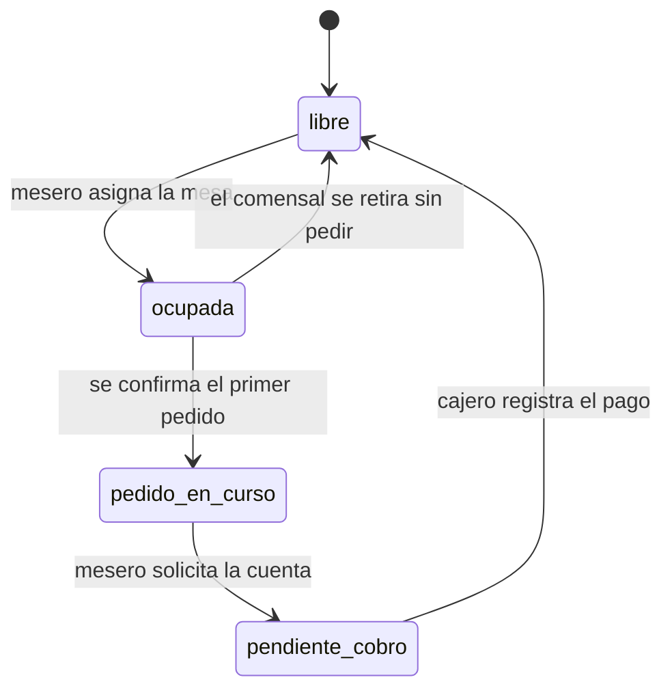
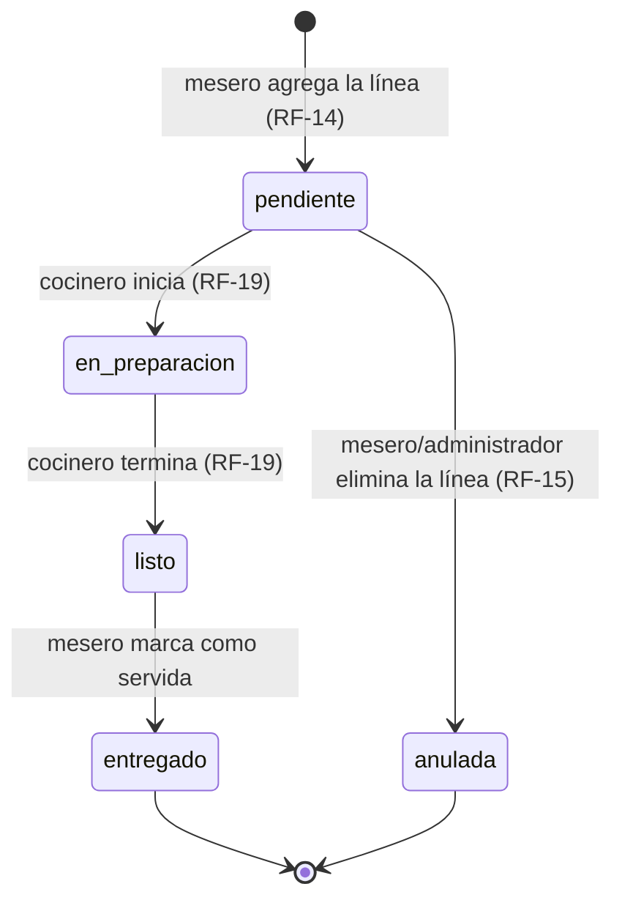

# Máquinas de estado — MenúGo

## Sesión de mesa (RF-11)

Estado visible en el mapa de mesas del salón. Se implementa con la columna `sesion_mesa.estado`; el estado **libre** no se almacena — ver la nota de diseño en [`modelo-datos.md`](modelo-datos.md#decisiones-de-diseño-que-no-son-obvias-del-diagrama).

| Transición | Quién la ejecuta | Precondición | Efecto en la base de datos |
|---|---|---|---|
| libre → ocupada | Mesero o administrador | La mesa no tiene ninguna `sesion_mesa` con `estado != cerrada` | INSERT en `sesion_mesa` (`estado = ocupada`), bajo `SELECT ... FOR UPDATE` sobre `mesa` (RNF-07) |
| ocupada → pedido_en_curso | Automática | El mesero confirma la primera línea de un `pedido` de esa sesión | UPDATE `sesion_mesa.estado = pedido_en_curso` |
| ocupada → libre | Mesero o administrador | No existe ningún `pedido` abierto en la sesión | UPDATE `sesion_mesa.estado = cerrada`, `cerrada_en = now()` |
| pedido_en_curso → pendiente_cobro | Mesero | Al menos un pedido de la sesión sigue abierto | INSERT en `cuenta` con el total calculado; UPDATE `sesion_mesa.estado = pendiente_cobro` |
| pendiente_cobro → libre | Cajero | La suma de `pago` cubre `cuenta.total` | UPDATE `cuenta.cerrada_en`, `sesion_mesa.estado = cerrada`, `cerrada_en = now()` |

No existe una transición directa de `pendiente_cobro` de vuelta a `pedido_en_curso`: una vez solicitada la cuenta, cualquier producto adicional se maneja como un pedido nuevo antes de cerrar, no reabriendo la cuenta ya generada.

## Línea de pedido (RF-19)

Estado de cada platillo dentro de un pedido, visible en la pantalla de cocina.

| Transición | Quién la ejecuta | Precondición | Notas |
|---|---|---|---|
| — → pendiente | Mesero | Ninguna | Estado inicial al agregar la línea |
| pendiente → en_preparacion | Cocinero | La línea aparece en la pantalla de cocina | |
| en_preparacion → listo | Cocinero | — | Dispara el aviso al mesero mencionado en la propuesta (sección 4.1) |
| listo → entregado | Mesero | El platillo ya está físicamente en la mesa | Cierra el ciclo de esa línea |
| pendiente → anulada | Mesero o administrador | La línea sigue en `pendiente` (RF-15: "mientras el platillo no haya iniciado su preparación") | Baja lógica, nunca `DELETE` (RNF-10) |

**No existe transición de `en_preparacion` o `listo` hacia `anulada`.** RF-15 limita la eliminación de líneas al estado `pendiente` explícitamente; una vez que la cocina empezó a prepararla, el insumo ya se comprometió. La única forma de retirarla después de ese punto es anular el `pedido` completo (RF-16), que es una decisión distinta —con motivo y responsable registrados— y no un cambio de estado de la línea individual.
