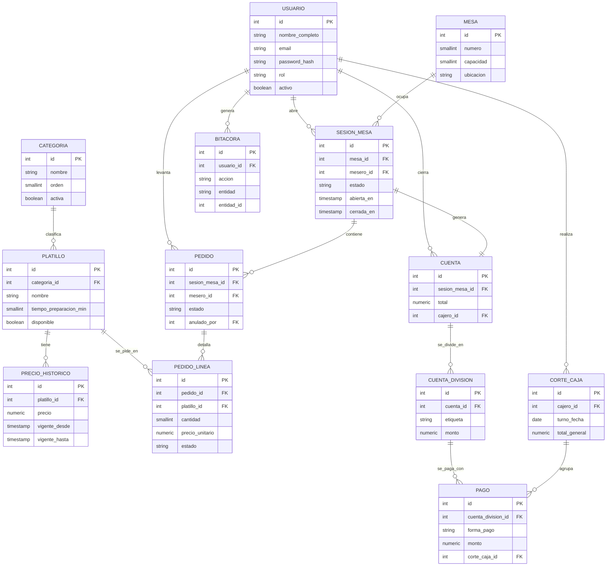

# Modelo de datos — MenúGo

Modelo entidad-relación completo (13 entidades) que sustenta los 8 módulos de la propuesta. El detalle campo por campo está en [`diccionario-datos.md`](diccionario-datos.md); las transiciones de estado en [`maquinas-estado.md`](maquinas-estado.md).

## Diagrama entidad-relación

## Cardinalidades y su justificación

| Relación | Cardinalidad | Por qué |
|---|---|---|
| categoria → platillo | 1:N | RF-01, RF-02 |
| platillo → precio_historico | 1:N | RF-04, historial de precios con vigencia |
| platillo → pedido_linea | 1:N | cada línea referencia el platillo pedido |
| usuario → sesion_mesa | 1:N | quién asignó la mesa |
| usuario → pedido | 1:N | RF-13, el pedido queda ligado al mesero que lo levantó |
| usuario → cuenta | 1:N | cajero que cerró la cuenta |
| usuario → corte_caja | 1:N | RF-24 |
| usuario → bitacora | 1:N | RF-30 |
| mesa → sesion_mesa | 1:N | historial de ocupaciones de una misma mesa |
| sesion_mesa → pedido | 1:N | ver nota de diseño abajo |
| pedido → pedido_linea | 1:N | RF-14 |
| sesion_mesa → cuenta | 1:1 | una cuenta final por cada ocupación de mesa |
| cuenta → cuenta_division | 1:N | RF-22; si no se divide, existe una sola división con el total |
| cuenta_division → pago | 1:N | permite pago mixto dentro de una misma división |
| corte_caja → pago | 1:N | RF-24, agrupa los pagos de un turno para el desglose por forma de pago |

## Decisiones de diseño que no son obvias del diagrama

**`sesion_mesa` permite más de un `pedido`, no es 1:1.** En el caso normal hay un único pedido abierto por sesión. Se modela 1:N porque RF-16 permite anular un pedido completo; si eso ocurre a mitad de la atención, el mesero necesita poder abrir un pedido nuevo sin cerrar la sesión de la mesa. Esto evita tener que reabrir una sesión ya cerrada.

**El estado "libre" de una mesa no se guarda en ninguna tabla, se calcula.** RF-11 pide mostrar la mesa como libre, ocupada, pedido en curso o pendiente de cobro. `sesion_mesa.estado` solo almacena `ocupada`, `pedido_en_curso`, `pendiente_cobro` y `cerrada`; una mesa se muestra como **libre** cuando no existe ninguna `sesion_mesa` suya con estado distinto de `cerrada`. Guardar "libre" como una fila de sesión no tendría sentido (no hay nada que registrar todavía), y derivarlo evita tener dos lugares que puedan quedar desincronizados. Detalle de la transición completa en [`maquinas-estado.md`](maquinas-estado.md).

**`precio_unitario` se copia a `pedido_linea` en el momento de agregar la línea.** Si el precio del platillo cambia después (RF-04), los pedidos ya tomados no deben verse afectados retroactivamente. Es el mismo motivo por el que existe `precio_historico` en primer lugar.

**Ningún registro se borra físicamente** (RNF-10): `pedido`, `pedido_linea` y `usuario` usan baja lógica (`estado='anulado'`/`'anulada'` o `activo=false`) en vez de `DELETE`. `sesion_mesa` conserva todas sus filas cerradas como historial de ocupación de cada mesa.
